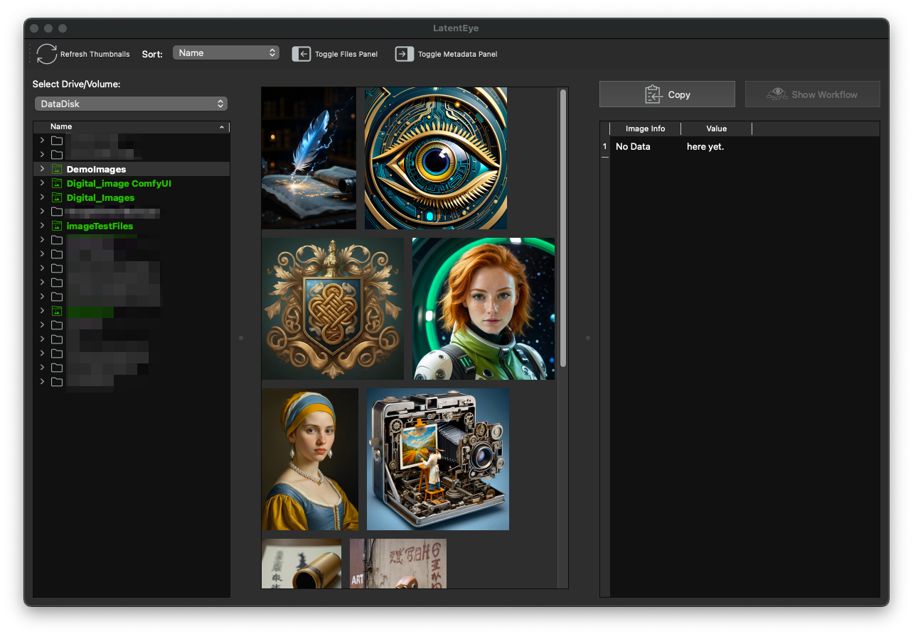

# LatentEye


<!-- 
-->

## The eye that sees into generative art.

## Introduction:
LatentEye allows you to visually explore local AI-generated images and uncover their hidden metadata. This user-friendly desktop app offers features for viewing, managing metadata, and clipboard operations. Primarily for ComfyUI and Stable Diffusion images but view any of the supported file types.

My interest in AI image generation began with [Automatic 1111](https://github.com/AUTOMATIC1111/stable-diffusion-webui), followed by a discovery of the amazing [ComfyUI](https://www.comfy.org). In the process of creating images, I struggled to find an image viewer that displayed my creations along with the metadata in a way I liked. This led me to create LatentEye, initially it is designed for ComfyUI and Stable Diffusion based tools, support additional apps may be added in the future

Prior to LatentEye, I had no knowledge of PyQt 6, so this project serves as my opportunity to learn it and many other diffuse and pythonic things along the way. This is a way for an old nerd to try and remain relevant. The name is a play on [Latent Space](https://www.ibm.com/think/topics/latent-space) and [Latent Image](https://comfyui-wiki.com/en/comfyui-nodes/latent/empty-latent-image). For the mathematicians or Generative AI developers, you might find this interesting: [Complexity Matters: Rethinking the Latent Space for Generative Modeling](https://arxiv.org/pdf/2307.08283). Just for the record, I'm not either and 99% of that paper I didn't understand. whoo hoo I'm a 1%er!?!? LOL.

LatentEye was designed, developed a Mac and and tested on MacOS and Linux. It is expected to run on Windows and maybe other platforms supported by Qt. I primarily only use Windows for playing [GuildWars 2](https://www.guildwars2.com) and a few other Steam games, so my testing on Windows has been very light.


Here are a few more [screenshots](./docs/screenshots.md) if interested.

## Features:
- Supports macOS, Linux and Windows.
- Thumbnail generation for browsing PNG, jpeg and webp images.<sup id="a1">[1](#f1)</sup>
- Display full metadata associated with images from ComfyUI and Stable Diffusion related tools
- Intelligent file tree that shows what directories have image files and on any drive.<sup id="a2">[2](#f2)</sup>
- EyeSight for full size viewing of selected image.
- Copy the metadata info to the system clipboard.
- Easy to use GUI with resizable elements and windows.
- Cross Platform by using PyQt6. Runs on Linux, macOS, and Windows.
- Dark mode

## Early Release Notice
LatentEys is finally at a stage where I feel other people can use it. Most of LatentEye works however you must absolutely expect some things to not work. The known issues are covered in [KnownIssues](./docs/known_issues.md)

Right now it works pretty well on MacOS and it works on Linux but has performance issues. Windows is untested.

# Installation

## Requirements:
- Python versions: 3.12.3 or later is required due to StringEnums being used.
- PyQt6 see: [Installing PyQt6](https://www.riverbankcomputing.com/static/Docs/PyQt6/installation.html)

In order to use LatentEye you need to have python3.12 or later on your system. If you don't have it installed instructions are provided in [Python3 installation ](./install_python.md)

## Installing LatentEye
Now were ready to actually install LatentEye. Just follow along with the steps below.

1. **Clone the repository:**
   change to the directory where you want to install LatentEye and open a shell window and...

   ```bash
   # if you have github ssh key setup.
   git clone git@github.com:AnotherWorkingNerd/LatentEye.git

   # not using ssh.
   git clone https://github.com/AnotherWorkingNerd/LatentEye.git

   cd LatentEye
   ```

1. **Create and Activate virtual environment:**<br/>
   If you already have a python virtual environment that has not been activated, activate it then skip to the next step Otherwise continue with the steps below.
   Create the venv for LatentEye anywhere you like but for this example we are going to create it in the LatentEye Directory and call it virtenv. if you change the name just remember to change it in all the command below.

   For Unix-based machines
   ```bash
   python3 -m venv virtenv
   ```

   ```bash
   . virtenv/bin/activate
   ```
   that's dot space then the path to the python virtual env.

   For for Windows-based machines -

   ```bash
   .\virtenv\Scripts\activate
   ```
1. **Verify the virtEnv is set up**<br/>
   for these commands use `python` not python3 so that you will use the `python` the virtual environment created in the first step otherwise you just the system python and it generally not a good idea to add a lot of stuff to the system python. Why, that is the case is way beyond the scope of these instructions. if you are interested a search engine or you favorite Chatbot is a good place to ask that.

   **for linux:**
   ```bash
   which python
   ```
   Should return something like `LatentEye/vertenv/bin/python`
   if you get an error here make sure you followed ***ALL*** the steps starting at step 1 and used the correct path in step 2.

   For Ubuntu and possibly other distro's there are additional steps that you may need to make also with some troubleshooting notes. All of this is covered in [Ubuntu Notes](./docs/Ubuntu_notes.md)

   **for Windows:**
   open cmd.exe or powershell(preferred) and simply type `python -V` it either works or it doesn't. Use `quit()` to exit python.

1. **Install the required packages:**

   ```bash
   pip install -r requirements.txt
   ```
   This will make sure that pip and the python setuptools are at the level needed then install:
   - PyQt version 6.8 or latest version. See [Riverbank Computing](https://www.riverbankcomputing.com) or [PyQt6 Reference Guide](https://www.riverbankcomputing.com/static/Docs/PyQt6/)
   - sd-prompt-reader - This gives LatentEye its vision. for more info see [sd-prompt-reader](https://pypi.org/project/sd-prompt-reader/).

1. **Open LatentEye**
   Presuming you are still in the LatentEye directory.
   ```
   python LatentEye.py
   ```
   You can also lauch LatentEye using different Qt styles. The names are:
    - Fusion
    - macOS
    - Windows

   use `python LatentEye.py -style [StyleName]` to use a different Qt style.

## Documentation
I think this is pretty well covered in [how to use LatentEye](./docs/How_to_use_LatentEye.md)

## Testing.
**Confirmed successful runs on the following:**
- Operating Systems:
  - MacOS Monterey or greater.
  - Ubuntu 24.04.1 LTS (Noble Numbat)
  - Windows 11

- Python Versions
  - 3.12
  - 3.13
- PyQt version 6.7 or later.

The testing was constrained by the resources at hand. It was tested  across multiple platforms, storage devices, and utilizing over 150 distinct image files from a wide range of publicly accessible AI generators.

## Contributing
Since this is a one man operation, contributions are always welcome!
Contributions in any form are encouraged so of the ways you can do this with little effort on your part:
- Star this repo.
- Spread the word about LatentEye by recommendeding the software to others.
- Your feedback about features you'd like to see or bugs reports, please provide detailed feedback here on GitHub.

Contributions requiring a bit more effort on your part:
 - If you have an AI generated image png, jpeg image that doesn't display the image or metadata properly please create a bug report and provide details of what the problem is and what was used generate it, and what was expected. if applicable, a copy of the existing metadata would be helpful for verification purposes.
- If you have something in mind that you would like to work on, please open a discussion issue first to discuss any implementation details to avoid duplicating efforts then open a PR when you feel that it is ready.
- Improving documentation, if you see typo's, bad grammer, or docs that can be improved please file an issue and let me know the details.

I had forgotten how much non-coding work went into setting up a public repo. Your involvment and support helps keep me motivated.

## LatentEye's vision for the future.

First on the list is, of course, getting LatentEye feature complete that means everything operates as I planned, intended, or expected. Here are some of the things that I'm working on now:
- EyeSight improvement - zoom, image sizing and other issues are taken care of. Maybe eating more carrots. :-)
- Fix plaform specific issues like Linux font sizes, etc.
- Lots of internal improvements with the code.
- Improve fileIO speed on Linux or at least progress bars.
- Testing on Windows.
- Rewriting or fixing any typos or mistakes in the ~~diments~~ documents I've written.

My vision for future versions, This list is incomplete, presented in random order, and **not** prioritized:
- Creating an installer or maybe executables.
- Render ComfyUI workflows. I don't know how much work this is.
- App save settings, like window locations and last used path.
- User setting. make things as configurable as possible. colors, fonts, file formats, etc.
- Media playback. videos and music
- better file handling including file rename, file delete, maybe file move and copy
- improve the UI / UX
- lots of coding improvements that would be completely unseen. This could cover all areas of LetentEye
- Adjustable font and font size for the file tree and better icons
- status bar

My actual TODO list is pretty long.

### Stuff LatentEye doesn't do and may never do.
- Image editing. Image editing is a specialized task. This is a viewer, and there are many excellent image editing tools available. I won't recommend a specific one, as your requirements may differ from those of others.
- Editing of the metadata. In a future version, will be the ability to clear image metadata, but this feature will focus solely on clearing, not editing.
- EXIF data. - That's the realm of photography not Generative AI and doesn't align LatentEye's vision. It could be added someday, but it's unlikely.
- Drag and drop. There are other apps that support that like [sd-prompt-reader](https://pypi.org/project/sd-prompt-reader/)
- Image Printing. It's highly improbable because of the necessary code and support. There are many better ways to print an image without adding this feature.

Of course this list is subject to change but the first and last ones are very unlikely to change.

## Localization
This is planned for a future version and will take quite a bit of refactoring of the existing code to facilitate Localization.

## THANKS!
_MANY_ Thanks got out to the following. Without them, LatentEye's would have never been opened.
- [Rhys Yang](https://pypi.org/user/receyuki/) for [sd-prompt-reader](https://pypi.org/project/sd-prompt-reader/).
- Riverbank Computing Limited and Phil Thompson for [PyQt6](https://www.riverbankcomputing.com/static/Docs/PyQt6/) - [https://www.riverbankcomputing.com](https://www.riverbankcomputing.com).
- The icons used in LatentEye came from [SVGRepo](https://www.svgrepo.com).

# MIT License
This project is licensed under the MIT License - see the [LICENSE](LICENSE) file for details.
The software includes third-party libraries that are subject to their own licenses and disclaimers.

----
#### Footnotes:

<a id="f1">1. metadata is not shown for .webp formatted files. [↩](#a1)</a>

<a id="f2">2. see the docs for more info on this [↩](#a2)</a>
