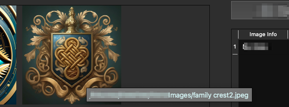
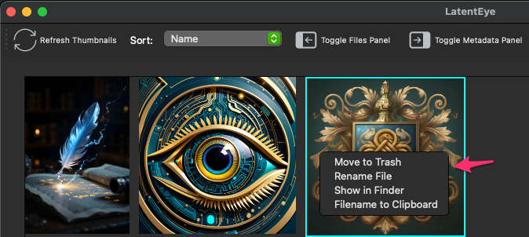
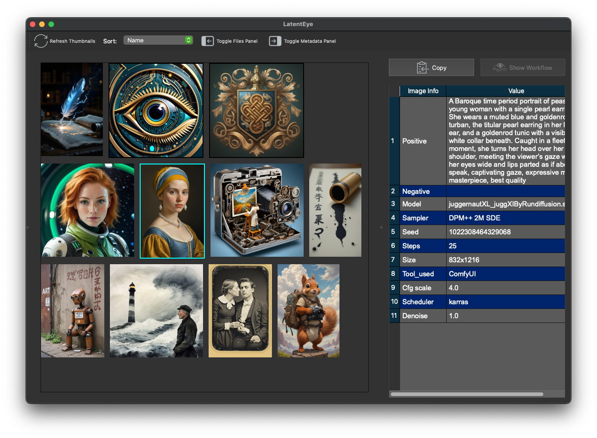
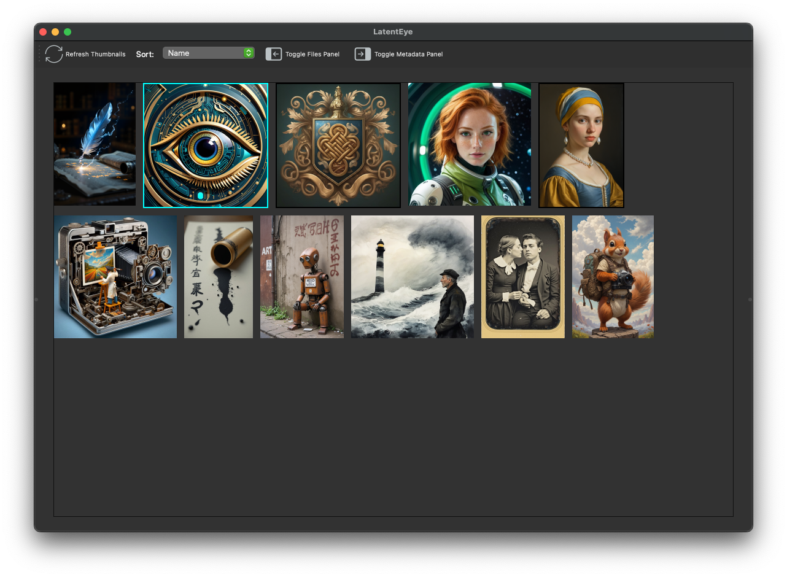
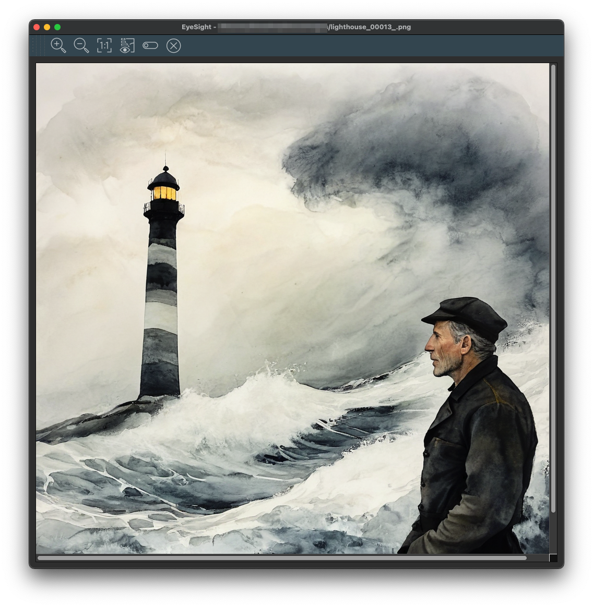
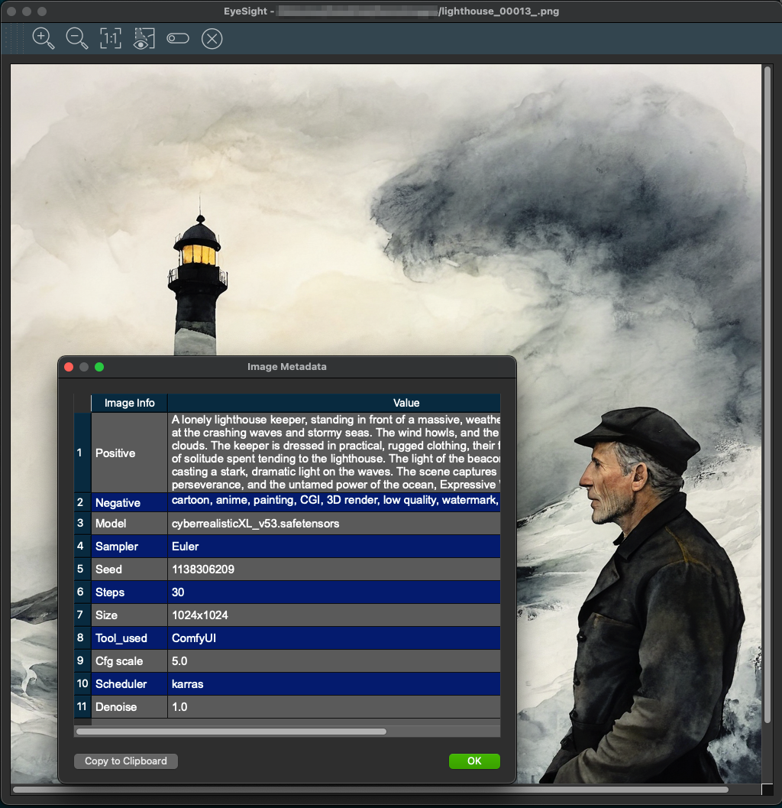

    

# How to use LatentEye

## Summary
LatentEye is a desktop GUI app and most things can be done with a mouse however there are standard keyboard shortcuts. LatentEye is composed of 2 main parts the main window you see when you start the app and EyeSight. The main LatentEye window provides the what and where... what directory from what location (i.e., where) and EyeSight provides the vision.

Note: LatentEye is still being worked on and I think most things have been fixed but there may still be some bugs.

## Usage
After launching LatentEye, choose the location of the images you want to view. To switch drives or volumes, use the dropdown menu above the file tree on the left side. Then, click on a green-highlighted folder to open it. Once a directory is selected, LatentEye will automatically generate thumbnails for all images in that folder, which will appear in the center window.

Clicking on a thumbnail will highlight it and show any available metadata associated with that image.

Once you have selected an image there are several things you can do now.
- **Single click:** Highlights the thumbnail and displays its SD/ComfyUI metadata.
- **Double click:** Opens the image in an EyeSight window.
- **Hover:** Displays a tooltip showing the fully qualified file name. 

 
- **Right click:** Opens a context menu with additional options:  
  - **Move to Trash:** Delete the file associated with the thumbnail
  - **Rename File:** Rename the file associated with the thumbnail.
  - **Show in file manager:** Opens the file in your system’s File Explorer or Finder, selecting it if possible.
  - **Filename to Clipboard:** Copies the full path and filename to the clipboard.

Across the top of the LatentEye window the toolbar provides the following controls (from left to right):

**Refresh Window** - Updates the thumbnail view if new images have been added to the currently selected directory. (Refreshing is generally not required after deleting or renaming files.)

**Sort** - Sorts the thumbnails according to the option selected in the dropdown menu.

**Toggle Files Panel** - Hides or displays the left side file-tree panel.
Clicking **Copy** (available here and in the EyeSight window) copies the filename and all displayed metadata to the system clipboard in plain text format.

**Toggle metadata Panel:** Hides or shows the metadata table panel on the right side.

## EyeSight
Double clicking a thumbnail opens the image in a resizable **EyeSight** window.
 
Multiple EyeSight windows can be opened simultaneously, allowing you to compare images and their metadata side by side. Of course, each image requires some system and GPU memory so there is a limit on your EyeSight. What that limit is for _you_ depends on _your system resources_.

### EyeSight Toolbar
The EyeSight toolbar can be repositioned by clicking and dragging its left edge. It may be left free-floating or docked to any side of the window, including the bottom.

#### The buttons from left to right
- Plus: zoom in
- Minus: zoom out
- 1:1 - reset zoom
- Eye: Metadata table dialog box.
- fixed
- X: Close Window

-- Fini --

---
---

## Quick reference

The saying goes, a picture is worth 1000 words so here is a picture that doesn't have 1000 words, even if they are older words.

