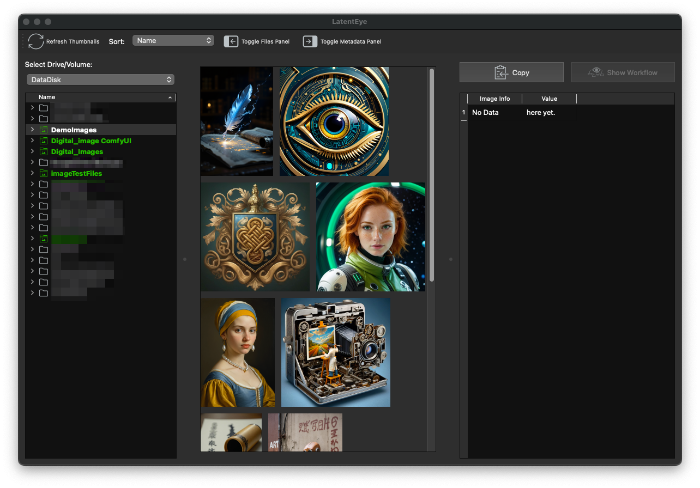

[latentEye logo and logo]

Note: LatentEye is in early release and while most things work there are areas that don't yet work or don't work as expected.

LatentEye is a desktop GUI app and most things can be done with a mouse however there are standard keyboard shortcuts. LatentEye is composed of 2 main parts the main window you see when you start the app and EyeSight. The main LatentEye window provides the what and where... what directory from what location (i.e., where) and EyeSight provides the vision.

After selecting the desired directory, thumbnails will be created of all the images in that directory and they will appear in the center window. This may take a moment  Hovering the mouse pointer over a thumbnail shows the fully qualified file name. Clicking on a thumbnail shows the SD/ComfyUI metadata for that image.

Clicking the copy button here or in the EyeSight window will send to the system clipboard the filename of the image and all the data you see in the in the metadata table, in Plain text format (tab delimited).

Double clicking on a thumbnail opens the image in EyeSight window. The toolbar icon with the eye will display metadata table for the image. You can compare 2 or more images with multiple EyeSight windows open. Simply double click or each thumbnail. Of course, each image requires some system and GPU memory. There is a window limit, what that limit is for _you_ depends on _your system_.

The saying goes, a picture is worth 1000 words so here is a picture that doesn't have 1000 words.

