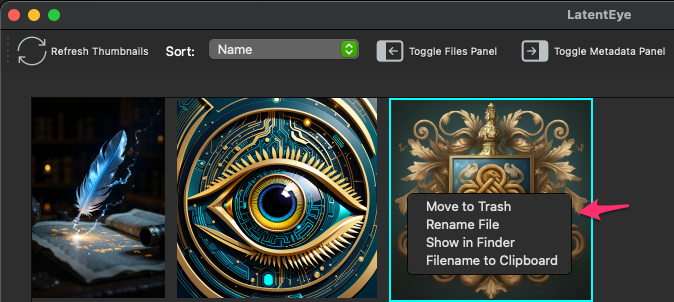

## LatentEye Screenshots

When you first start LatentEye and have selected a directory.

With the file tree panel off and showing the metadata for the selected image.

Both panels off. This can be helpful if you have a lot of images.

Context menu for limited file management

Double click on a thumbnail for EyeSight.

Click on the toolbar icon with the eye to get metadata.

