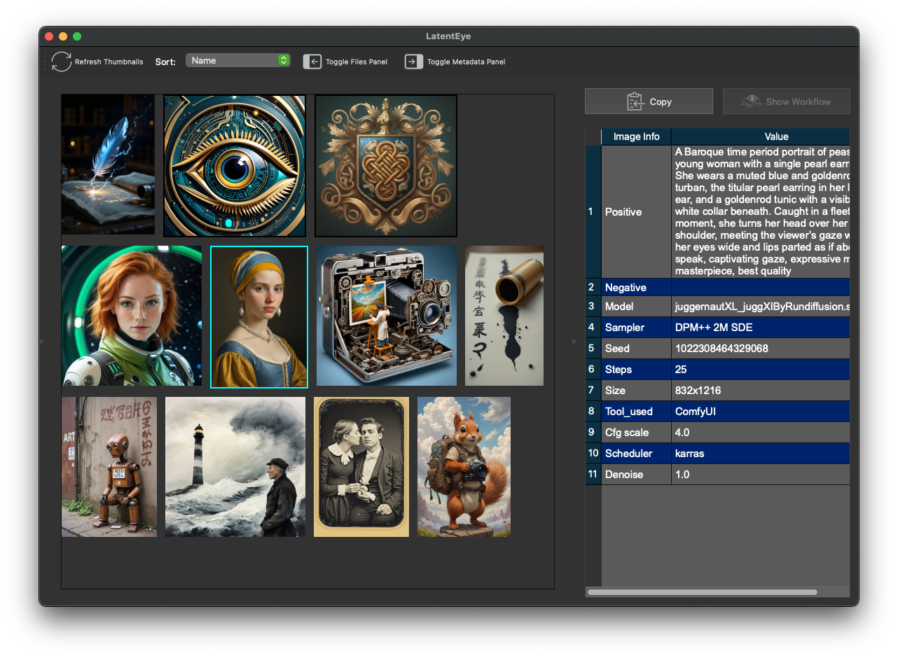
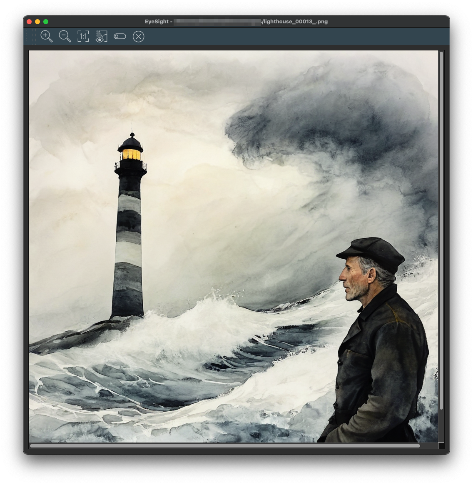
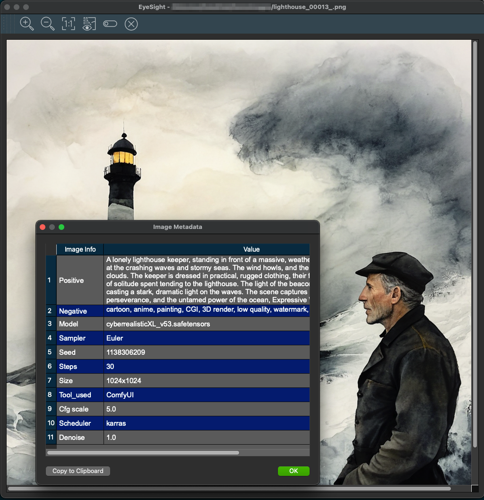

## LatentEye Screenshots

When you first start LatentEye and have selected a directory.

With the file tree panel off and showing the metadata for the selected image.

Both panels off. This can be helpful if you have a lot of images.

Double click on a thumbnail for EyeSight.

Click on the toolbar icon with the eye to get metadata.

Tip: You can compare 2 or more images with multiple EyeSight windows open. Simply double click or each image. Of course each image requires some system and GPU memory. There is a window limit, what that limit is for _you_ depends on _your system_

The data copied to the clipboard contains the filename of the image and all the data you see in the table. Tab delimited Plain text format.
